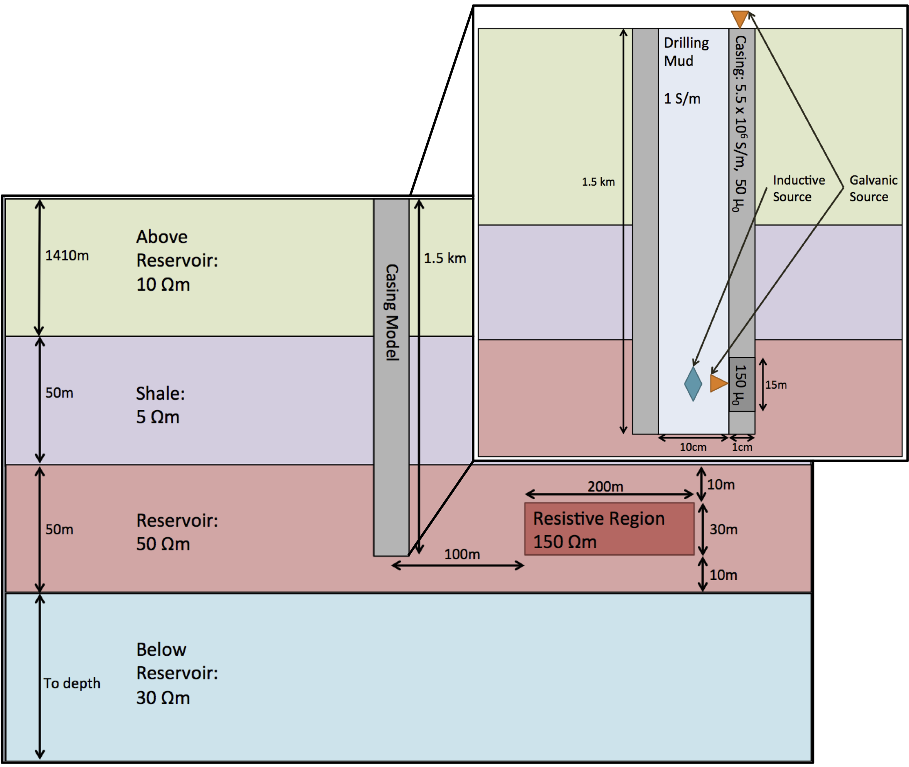

# Modelling electromagnetic problems in the presence of cased wells

_Lindsey J. Heagy, Rowan Cockett, Douglas W. Oldenburg, and Michael Wilt_

https://doi.org/10.1190/segam2015-5931035.1

## Summary 

Electrical conductivity can be a diagnostic physical property for distinguishing geologic units and delineating the distribution of fluids such as hydrocarbons and saline water within these units. Electromagnetic (EM) methods are sensitive to conductivity contrasts and can be used to characterize them. They are increasingly being applied in settings where cased wells are present. Most commonly-used casing materials, such as steel, are highly conductive, have a significant, often variable, magnetic permeability, and therefore significantly impact the behavior of the EM fields and fluxes. The aim of this paper is to revisit numerical modelling strategies to investigate the role of various properties and complexities due to the casing, and present a modelling and inversion strategy, using a primary-secondary approach, for capturing the impacts of both the variable casing and three dimensional geologic structures on EM data.

## Citation 

Lindsey J. Heagy*, Rowan Cockett, Douglas W. Oldenburg, and Michael Wilt, (2015), "Modelling electromagnetic problems in the presence of cased wells," SEG Technical Program Expanded Abstracts : 699-703.
https://doi.org/10.1190/segam2015-5931035.1

